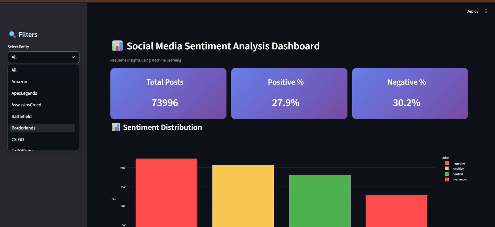
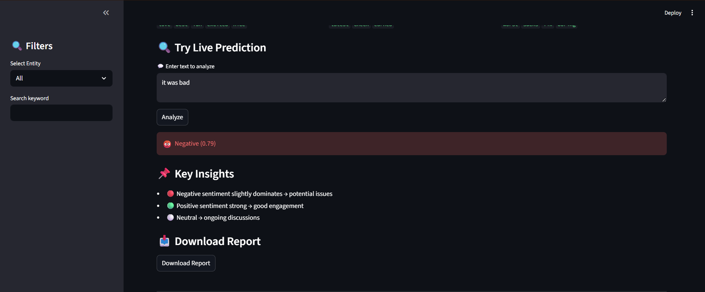
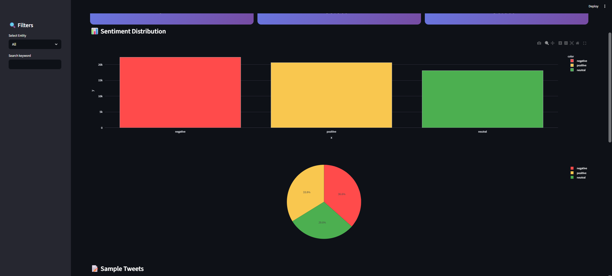
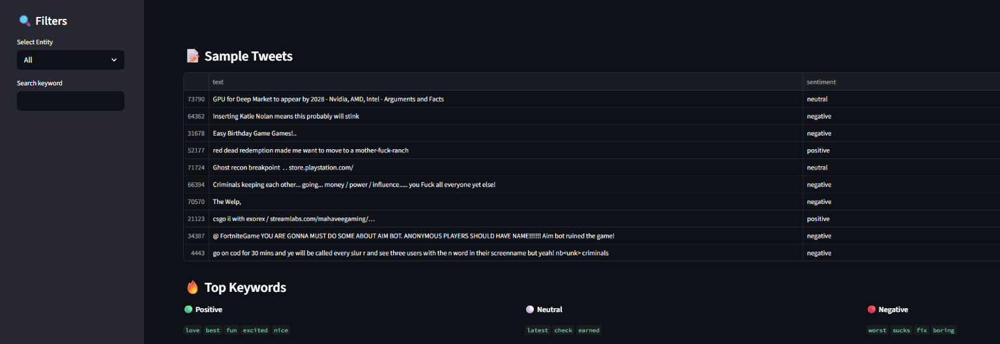
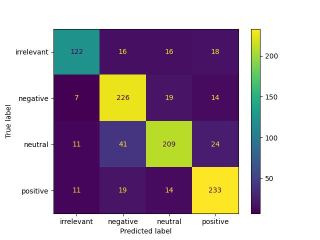

# 📊 Social Media Sentiment Analysis Dashboard

## 🚀 Live Demo
🔗 https://social-media-sentiment-analysis-dashboard-xq5nirtqbjwez4vuzk4e.streamlit.app/


## 🚀 Overview

This project is a complete **end-to-end Sentiment Analysis System** that analyzes social media text data and classifies it into:

- 🟢 Positive
- 🔴 Negative
- ⚪ Neutral

It uses **Machine Learning (Logistic Regression)** and **Natural Language Processing (NLP)** techniques.

An interactive **Streamlit Dashboard** is included to visualize insights and perform real-time predictions.

---

## 🎯 Problem Statement

Organizations receive massive amounts of user-generated content daily (tweets, comments, reviews).
Manually analyzing sentiment is inefficient and impractical.

This project automates:

- Sentiment detection
- Trend visualization
- Insight generation for decision-making

---

## 🧠 Key Features

- ✅ Real-world Twitter dataset
- ✅ Text preprocessing (cleaning, stopwords removal)
- ✅ TF-IDF feature extraction
- ✅ Logistic Regression model
- ✅ ~93% accuracy on validation data
- ✅ Confusion Matrix visualization
- ✅ Interactive Streamlit dashboard
- ✅ Sentiment distribution (Bar + Pie charts)
- ✅ Entity-based filtering
- ✅ Live sentiment prediction
- ✅ Confidence score display
- ✅ Keyword search functionality
- ✅ Top keywords extraction
- ✅ Downloadable report
- ✅ Mobile-friendly UI

---

## 🏗️ Architecture

```text
CSV Data → Text Cleaning → TF-IDF → ML Model → Prediction → Dashboard
```

---

## 📂 Project Structure

```text
Social-Media-Sentiment-Analysis-Dashboard/
│
├── data/
│   ├── twitter_training.csv
│   └── twitter_validation.csv
│
├── src/
│   ├── preprocess.py
│   ├── train.py
│   └── predict.py
│
├── app/
│   └── app.py
│
├── models/
│   ├── model.pkl
│   └── vectorizer.pkl
│
├── outputs/
│   ├── confusion_matrix.png
│   └── metrics.txt
│
├── images/
│   ├── dashboard_main.png
│   ├── prediction_demo.png
│   ├── charts.png
│   ├── top_keywords.png
│   └── confusion_matrix.png
│
├── requirements.txt
└── README.md
```

---

## ⚙️ Installation

```bash
git clone https://github.com/your-username/social-media-sentiment-analysis-dashboard.git
cd social-media-sentiment-analysis-dashboard

python -m venv venv
venv\Scripts\activate

pip install -r requirements.txt
```

---

## ▶️ How to Run

### Train the Model

```bash
python src/train.py
```

### Run the Dashboard

```bash
streamlit run app/app.py
```

---

## 📊 Results

- 📈 Model Accuracy: **~93%**
- Balanced performance across all sentiment classes

---

## 📸 Dashboard Preview

### 🔹 Main Dashboard



### 🔹 Prediction Demo



### 🔹 Charts



### 🔹 Top Keywords



### 🔹 Confusion Matrix



---

## 📌 Key Insights

- 🔴 Negative sentiment slightly dominates → indicates possible issues
- 🟢 Positive sentiment remains strong → good user engagement
- ⚪ Neutral sentiment shows ongoing discussions

---

## 💼 Industry Applications

- Customer feedback analysis
- Brand sentiment tracking
- Product review monitoring
- Social media analytics
- Marketing campaign evaluation

---

## 🔮 Future Improvements

- Real-time Twitter API integration
- Deep learning models (BERT)
- Cloud deployment (Streamlit Cloud / AWS)
- User authentication system

---

## 👨‍💻 Author

**Varda**
CSE (AI & ML) Student

---

## ⭐ Support

If you found this project useful, consider giving it a ⭐ on GitHub!
